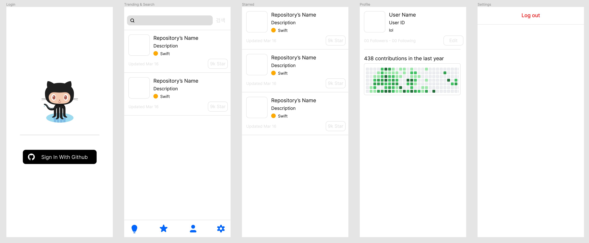

# :game_die: small-apps

> iOS 학습 내용이해를 위한 실습예제 및 내용정리 저장소

## 예제 프로젝트 구성

> 깃허브 트랜딩과 검색 Star관리 프로젝트를 구성하여 실습 예제로 사용

## Figma

> https://www.figma.com/file/inFmSmLVg0xtIlPZ1GCm0h/Github-Trending-App?node-id=0%3A1